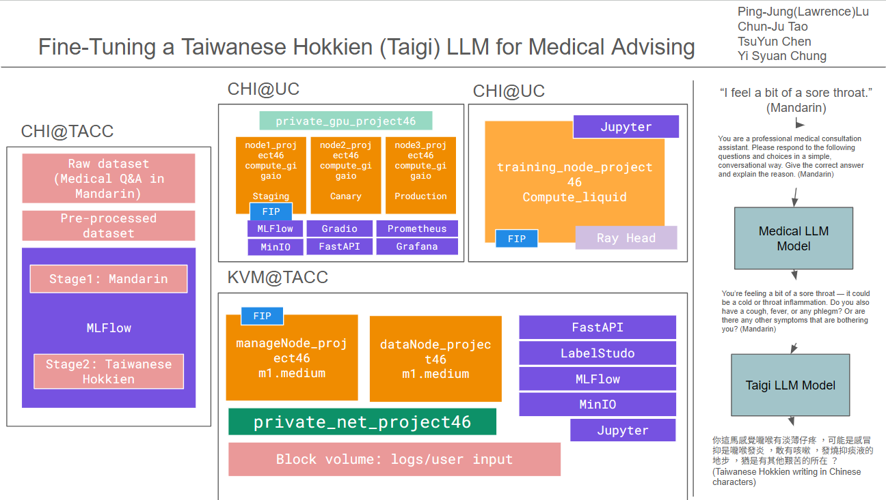
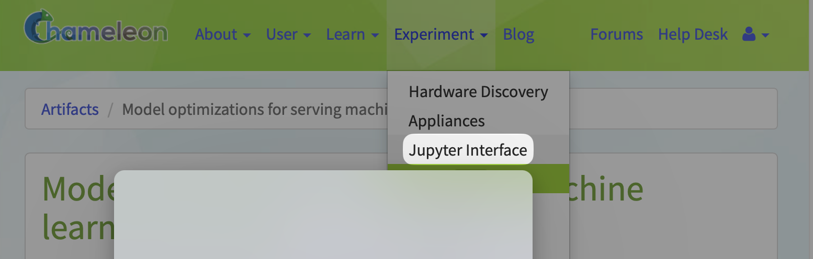
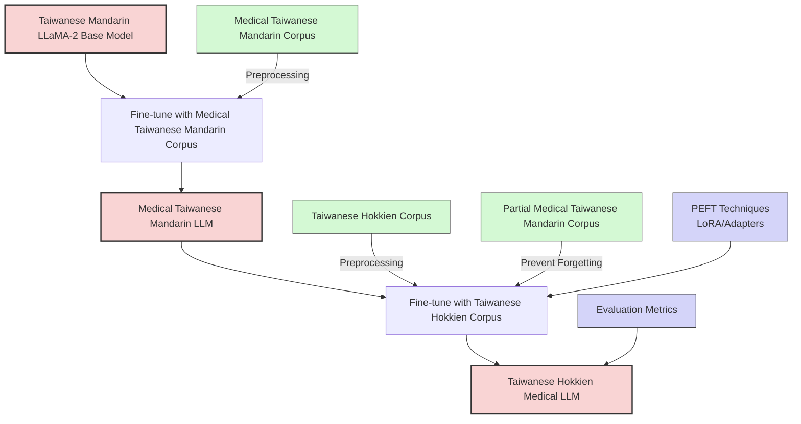
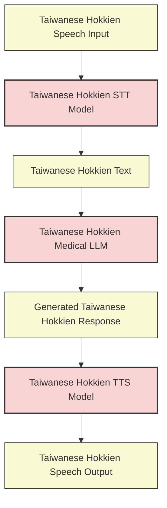
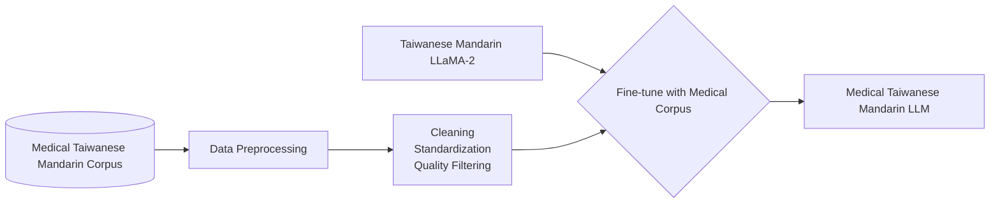
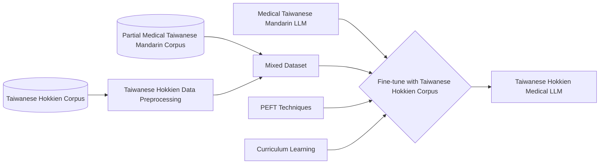
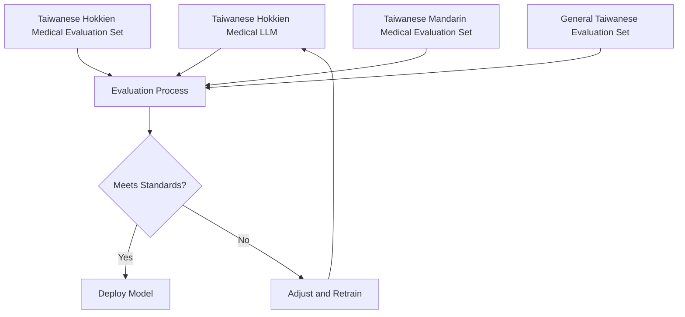

# Fine-Tuning a Taiwanese Hokkien LLM for Medical Advising

## Diagram



## Instructions

** Model requires 33G VRAM to run. **

### Preparing data

Follow instruction on notebook "[dataNode_setUp.ipynb](https://github.com/LawrenceLu0904/Fine-Tuning-Taiwanese-Hokkien-LLM-for-Medical-Advising/blob/main/dataNode_setUp.ipynb)"

### Setting up Model Serving and monitoring

Follow instruction on notebook "[create_chameleon_server.ipynb](https://github.com/LawrenceLu0904/Fine-Tuning-Taiwanese-Hokkien-LLM-for-Medical-Advising/blob/main/create_chameleon_server.ipynb)" until Docker installation finishes.
After setting up the server, follow instructions under "[/docker](https://github.com/LawrenceLu0904/Fine-Tuning-Taiwanese-Hokkien-LLM-for-Medical-Advising/tree/main/docker)"

### Training

Copy `create_chameleon_server.ipynb` and run in Chameleon Jupyter Interface



Follow the notebook to
 - Launch and set up the Chameleon server
 - Set up Git SSH Key and user
 - Clone the project
 - Set up Docker and NVIDIA container toolkit

### Step 1: Create a Virtual environment: (taigi-env) or any name you prefer

```shell
python3 -m venv taigi-env
source taigi-env/bin/activate
```

### Step 2: Install requirement packages in your virtual environment:

```shell
pip install -r requirements.txt
```

__There are some packages that need to be installed manually (follow the instructions below):__
```shell
pip install sentencepiece --prefer-binary
```

```shell
pip install datasets
```


### Step 3: Log in Hugging Face CLI with your own token:

```shell
huggingface-cli login
```

### Step4: if you are retrainning the model, if you are not retrainning the model, skip to Step5.

```shell
cd scripts/
python3 train_stage1.py
```

__After running train_stage1.py, if it shows an error like this:__


__Follow instructions below:__

__Step 1:__ clear it first:

```shell
pip uninstall bitsandbytes -y
```

__Step 2:__ reinstall:

```shell
pip install bitsandbytes --no-cache-dir
```

__Step 3:__ test it with `python -m bitsandbytes` command, it sould show:


Than rerun python3 train_stage1.py, it should now work successfully.

### Step5: Run inference.py to Chat with the model:

```shell
python3 inference.py
```
You can now enter the question you want to ask.
__Step 3:__ test it with `python -m bitsandbytes` command, it sould show:


Than rerun python3 train_stage1.py, it should now work successfully.

## MLflow Experiment Tracking

Enabled in `scripts/train_stage2.py`:

```python
mlflow.set_tracking_uri("http://<your-floating-ip>:5000")
mlflow.set_experiment("taigi-llm-training")
```

All runs will appear at: `http://<your-floating-ip>:5000`

### Launch MLflow tracking server

```bash
mlflow server --host 0.0.0.0 --port 5000 --backend-store-uri ./mlruns --no-serve-artifacts
```

- Open in browser: `http://<your-floating-ip>:5000`
- Ensure port **5000 is open** in your security group AND allowed by `firewalld` on Chameleon

### Step5. Run Inference with Confidence

```bash
python3 inference.py
```

You’ll get:
- model response
- confidence score per token
- average confidence


### Continuous X

Follow instructions under "[/mlops](https://github.com/LawrenceLu0904/Fine-Tuning-Taiwanese-Hokkien-LLM-for-Medical-Advising/tree/main/mlops)"


## Details
<!-- 
Discuss: Value proposition: Your will propose a machine learning system that can be 
used in an existing business or service. (You should not propose a system in which 
a new business or service would be developed around the machine learning system.) 
Describe the value proposition for the machine learning system. What’s the (non-ML) 
status quo used in the business (MUST include the company name) or service? What business metric are you going to be 
judged on? (Note that the “service” does not have to be for general users; you can 
propose a system for a science problem, for example.)
-->

Taiwanese Hokkien, commonly known as the Taiwanese language or Taiwan Taigi (臺灣台語), is a language spoken natively by approximately 70% of Taiwan's population.

Currently, elderly individuals in rural areas spend considerable time and energy reaching hospitals for consultations. Due to the digital divide, existing communication software-based video consultation services remain underutilized by the elderly population.

Our project aims to create a large language model specialized in medical advisors capable of communicating in Taiwanese Hokkien. This model could provide preliminary medical information to elderly speakers, enhancing disease prevention and encouraging early treatment. We can then integrate the LLM with existing Taiwanese Hokkien [Speech-to-Text](https://www.kaggle.com/competitions/espnet-taiwanese-asr/overview) and [Text-to-Speech](http://tts001.iptcloud.net:8804/)*1 models to provide a voice-based service. This human-centered design minimizes technology adoption barriers by meeting users in their native language context, extending technological assistance to traditionally underserved rural communities and elderly populations who might otherwise struggle with standard Mandarin UI-based systems.

The system will be explicitly designed and marketed as a preliminary information tool rather than a diagnostic service. Users will be informed that "this system provides general health information only and is not a substitute for professional medical diagnosis or treatment." We will also need a committee of healthcare professionals to review system responses periodically and make sure AI suggestions do not make mistakes. The system will need to comply with Taiwan FDA's Artificial Intelligence / Machine Learning-Based Software as Medical Device ([AI/ML-Based SaMD](https://www.fda.gov.tw/tc/includes/GetFile.ashx?id=f637648052118207932)) and Taiwan FDA's [Guidance for Industry on Management of Cybersecurity in Medical Devices](https://www.fda.gov.tw/tc/includes/GetFile.ashx?id=f637558103530220620).

We anticipate that hospitals and clinics could adopt or integrate this system into the existing National Health Insurance App, enabling technology to assist previously underserved rural and elderly populations. This would promote better health outcomes among citizens while improving resource utilization efficiency across Taiwan's healthcare system, creating a more accessible and equitable healthcare environment that respects linguistic preferences while leveraging technological innovation.

*1, this is a demo website of TTS system with translation capability developed by Speech AI Research Center, National Yang Ming Chiao Tung University, Taiwan
### Contributors

<!-- Table of contributors and their roles. 
First row: define responsibilities that are shared by the team. 
Then, each row after that is: name of contributor, their role, and in the third column, 
you will link to their contributions. If your project involves multiple repos, you will 
link to their contributions in all repos here. -->

| Name                  | Responsible for                             | Link to their commits in this repo |
|-----------------------|---------------------------------------------|------------------------------------|
| All team members      |                                             |                                    |
| Ping-Jung(Lawrence)Lu | Model training (unit 4 and 5)               |                                    |
| Chun-Ju Tao           | Model serving (unit 6), monitoring (unit 7) | [b19dfc3](../../commit/b19dfc3b2d51eea6feaca65baeb56e31ba31b512)  |
| TsuYun Chen           | Data pipeline (unit 8)                      |                                    |
| Yi Syuan Chung        | Continuous X pipeline (unit 3)              |                                    |


### System diagram

<!-- Overall digram of system. Doesn't need polish, does need to show all the pieces. 
Must include: all the hardware, all the containers/software platforms, all the models, 
all the data. -->

#### Taiwanese Hokkien Medical LLM Construction Process

#### Taiwanese Hokkien Medical LLM with Speech Input/Output

#### Training Stage Details
Stage 1: Medical Taiwanese Mandarin LLM Construction

Stage 2: Taiwanese Hokkien Medical LLM Conversion


#### Evaluation and Deployment Process



### Summary of outside materials

<!-- In a table, a row for each dataset, foundation model. 
Name of data/model, conditions under which it was created (ideally with links/references), 
conditions under which it may be used. -->

| Name                                 | Type       | Creation & Lineage                                                                                                                                                                                                                                  | License                                                                              | Ethical Considerations                                                                                                                                                                                                 | Documentation                                            | Link                                                                    |
|--------------------------------------|------------|-----------------------------------------------------------------------------------------------------------------------------------------------------------------------------------------------------------------------------------------------------|--------------------------------------------------------------------------------------|------------------------------------------------------------------------------------------------------------------------------------------------------------------------------------------------------------------------|----------------------------------------------------------|-------------------------------------------------------------------------|
| MedQA                                | Dataset    | Created by researchers from Columbia, Stanford, U. of Florida, and MIT in 2020. Compiled from professional medical board exams (USMLE) and textbooks from the USA, China, and Taiwan. Data was processed into JSONL format with multiple languages. | MIT License                                                                          | Contains medical information with potential privacy concerns. Does not contain patient data but includes medical case scenarios and knowledge. Pre-processed to standardize question formats across different sources. | [MedQA Paper](https://arxiv.org/pdf/2009.13081v1)        | [MedQA Dataset](https://paperswithcode.com/dataset/medqa-usmle)         |
| Taiwanese Hokkien Corpus (Huē-ji̍p)  | Dataset    | Compiled from multiple sources including Taiwanese Hokkien dictionaries, news articles, literature, and educational materials. Created through community efforts to preserve and document the language.                                             | Mixed: MIT License and CC BY-ND 3.0 TW                                               | Represents an endangered language with cultural preservation importance.                                                                                                                                               | See more in GitHub Link                                  | [Huē-ji̍p GitHub](https://github.com/Taiwanese-Corpus/hue7jip8)         |
| TIADE-LX                             | Base model | Developed by the National Institutes of Applied Research in 2023. Created by fine-tuning LLaMA2-7B with Taiwanese domain-specific data and Traditional Chinese corpus. Optimized for Traditional Chinese language understanding and generation.     | Non-exclusive, non-transferable license that complies with Meta AI's Llama 2 license | Inherits biases from the original LLaMA2 model. May have limited representation of certain Taiwanese cultural contexts despite domain adaptation.                                                                      | N/A                                                      | [TAIDE-LX-7B on Hugging Face](https://huggingface.co/taide/TAIDE-LX-7B) |
| Taiwanese Hokkien LLM                | Base model | Developed by Lee et al. in 2024. Created by fine-tuning TIADE-LX on a limited Taiwanese Hokkien corpus. First LLM specifically designed for Taiwanese Hokkien language processing.                                                                  | MIT License                                                                          | Limited training data result in uneven performance across different Taiwanese Hokkien expressions. May not fully represent all dialectal variations within Taiwanese Hokkien.                                          | [TW-Hokkien-LLM Paper](https://arxiv.org/abs/2403.12024) | [TW-Hokkien-LLM GitHub](https://github.com/lbh0830/TW-Hokkien-LLM)      |

### Summary of infrastructure requirements

<!-- Itemize all your anticipated requirements: What (`m1.medium` VM, `gpu_mi100`), 
how much/when, justification. Include compute, floating IPs, persistent storage. 
The table below shows an example, it is not a recommendation. -->

| Requirement     | How many/when                                     | Justification                      |
|-----------------|---------------------------------------------------|------------------------------------|
| `m1.medium` VMs | 2 for entire project duration                     | data processing, serving           |
| `gpu_mi100`     | 4 hour block twice a week                         |                                    |
| Floating IPs    | 3                                                 | for on each cluster                |

### Detailed design plan

<!-- In each section, you should describe (1) your strategy, (2) the relevant parts of the 
diagram, (3) justification for your strategy, (4) relate back to lecture material, 
(5) include specific numbers. -->

#### Model training and training platforms

<!-- Make sure to clarify how you will satisfy the Unit 4 and Unit 5 requirements, 
and which optional "difficulty" points you are attempting. -->

#### Model serving and monitoring platforms

##### Unit 6: Model serving

<!-- Make sure to clarify how you will satisfy the Unit 6 and Unit 7 requirements, 
and which optional "difficulty" points you are attempting. -->

Requirements Specification
   - Model Size:
   7b Model, about 20 GB model size
   - Latency Requirements:
     - <500ms response time for text queries
   - Throughput Requirements:
     - Support for 2 concurrent users during peak hospital hours
   - Concurrency Requirements:
     - Scale to support 5 simultaneous active conversations

The ./docker folder is the endpoint for Unit 6 model serving, Unit 7 Evaluation and Monitoring.
```
├── docker
│   ├── README.md
│   ├── backend
│   │   ├── Dockerfile
│   │   ├── app.py
│   │   ├── docker-compose-production-cpu.yml
│   │   ├── docker-compose-production.yml
│   │   └── requirements-serve.txt
│   ├── feedback_loop
│   │   ├── docker-compose-airflow.yml
│   │   └── docker-compose-labelstudio.yml
│   ├── monitoring
│   │   └── docker-compose-monitor.yml
│   └── web
│       ├── Dockerfile
│       ├── requirements.txt
│       └── web.py
```

**[Backend](https://github.com/LawrenceLu0904/Fine-Tuning-Taiwanese-Hokkien-LLM-for-Medical-Advising/tree/feature-human-approve-layer/docker/backend)**

The backend of the project is powered by FastAPI, serving as the main interface for LLM-based response generation and status checking. The backend is containerized with Docker and integrated with MinIO for session storage. 


`docker-compose-production.yml`: The Docker Compose file for building up the backend, frontend, and object storage.
- GPU with at least 40GB VRAM and CUDA is required.
- To run the project for testing on KVM virtual machines without GPU, use docker-compose-production-cpu.yml instead.

`app.py`: FastAPI backend Service. This is the main application file that sets up the API endpoints for generating LLM responses and querying status.
- Load the LLM model and prepare for inferencing, automatically pull the base model from Hugging Face with the provided token
- Provide a dummy mode that does not load the model for testing on KVM virtual machines without GPU
- Serve POST /generate API that generates a response from the LLM Model and responds 
    - However, if human approval is required: 1. generate response from LLM model, 2. save the session (request, response, id, …) to MinIO storage and tag `status: needs_review`, 3. Respond that this request needs review from the doctor
- Serve GET /status/{session_id} API that checks human approval status from MinIO
Serve GET /metrics:
The application integrates with Prometheus for real-time metrics collection.

**[Monitor](https://github.com/LawrenceLu0904/Fine-Tuning-Taiwanese-Hokkien-LLM-for-Medical-Advising/tree/feature-human-approve-layer/docker/monitoring)**

`docker-compose-monitor.yml`: The Docker Compose file that builds up Grafana and Prometheus for monitoring numbers of requests, response latency, and numbers of errors.
- dashboard and data source definition is under config/grafana and config/grafana/dashboards to provide the same dashboard setup for each time the services are built and avoid ClickOps

**(Feedback_loop)[https://github.com/LawrenceLu0904/Fine-Tuning-Taiwanese-Hokkien-LLM-for-Medical-Advising/tree/feature-human-approve-layer/docker/feedback_loop]**

The project has two feedback loops. User feedback loop collects “good response” and “bad response” feedback from the frontend. Airflow DAGs schedules the pipeline and sends them to Label Studio for review and annotate the model’s answers, improving the model over time with supervised fine-tuning on those annotations. Medical doctor feedback loop, also called as human approval layer, intercepts LLM’s response, and tag as “needs review”. Airflow DAG schedules the pipeline and sends them to Label Studio for medical doctors to review, and send back to MinIO.

`docker-compose-airflow.yml`: The Docker Compose file that builds up Airflow website, setup, scheduler, and Postgres.
- DAGs are stored in config/airflow/dags

`docker-compose-labelstudio.yml`: The Docker Compose file that builds up Label Studio and a Jupyter Notebook for experiments.

**(Frontend Web)[https://github.com/LawrenceLu0904/Fine-Tuning-Taiwanese-Hokkien-LLM-for-Medical-Advising/tree/feature-human-approve-layer/docker/web]**

The frontend of the project is powered by Gradio, providing a web-based UI for interacting with the LLM model and managing session-based conversations. 

`web.py`: Gradio Frontend Interface
This is the main application file that sets up the Gradio interface for user interaction, response generation, and status polling.
- Provide a chat interface with
    - conversation with history
    - input box for user input
    - Temperature, too_p parameter slide bars
    - submit button
    - check human approval status button
    - Positive / negative feedback buttons.
- Each call creates a new session_id and logs the conversation into MinIO 
- If human approval is required, the user will see with a message clearly states the response requires doctor approval.
- If human approval is not required, the conversation is immediately shown to the user
- Session Logging:
    - For every interaction, a log is created and stored in MinIO under the path: conversation_logs/{session_id}.json
- Each log object is tagged with the following metadata for traceability:
   - session_id: The unique identifier for the session.
   - processed: "false" initially, updated to "true" upon feedback.
   - feedback_type: "none", "like", or "dislike".
   - confidence: "1.000" by default, updated upon feedback.
   - timestamp: UTC timestamp of the interaction.

- Polling Status: When a session is tagged as "needs_review", the frontend can poll the /status/{session_id} endpoint to check the status of the review.
    - If approved, the response is displayed in the chat.
    - If rejected, the rejection reason is shown.
- When use click on “good response” or “bad response”, gradio updates the MinIO object tag to reflect the feedback

**Access the services**
Ensure port forwarding is enabled with
```
# your local terminal
ssh -i ~/.ssh/id_rsa_chameleon -L
7860:localhost:7860 cc@your_remote_ip
```

- Gradio Interface (User Inference UI): Navigate to http://localhost:7860 to access the Gradio web

- FastAPI Endpoint (Backend API): Use REST API directly or open http://localhost:8000/docs to see the interactive Swagger UI. 

- MinIO Console (Object Storage UI): Go to http://localhost:9000

- Airflow UI (Pipeline Orchestration): Visit http://localhost:8080. You can trigger DAGs manually and monitor their activities

- Grafana (Monitoring Dashboards): Visit http://localhost:3000

- Label Studio (Annotation UI): Go to http://localhost:8081


Demo Guide: Human Approval Layer

- Open the Gradio web interface http://localhost:7860 in your browser. You’ll see a simple chat UI with input form.
- Type your question in the text box. You can ask in Taiwanese Hokkien (Taigi) representing in Traditional Mandarin characters.
    - Example: You might ask: 「我今仔日咳嗽甲頭痛，愛按怎辦？」 (Taigi, meaning "I have a cough and headache today, what should I do?").
- You should see it respond with needs review message
- Open Airflow and wait for the next schedule or tigger dispatch manually 
- Open Label Studio and label the new respond
- Wait for next schedule or trigger sync manually 
- Back to Gradio and click Check Status button

If Airflow DAGs are missing:
- Refresh the UI and wait a moment.
- Activate:
 - HAL_pipeline_1_human_review_dispatch
	-	HAL_pipeline_2_human_review_sync

Troubleshooting
	-	If you encounter errors, rebuild the docker

Human Approval Layer Logic


3. Model optimizations

   1. Baseline Model Performance Measurement
      *   The metrics we will collect include:
          *   Single sample inference latency (median, p95, p99)
          *   Batch inference throughput (frames/tokens/sequences per second), with various batch sizes
          *   Model size on disk (in GB)
          *   Model accuracy
       
   2. Graph Optimization Experiments
       *   ONNX Runtime
       *   Visualization tools: Netron

   3. Quantization and Reduced Precision Experiments
       * Post-Training Quantization
           *   INT8
           *   Mixed-Precision
       * Look for techniques to recover accuracy lost during quantization.
           * Quantization-Aware Fine-Tuning (QAT)
           * L4Q
           * ...
       * Hardware-Specific Quantization
           * ONNX Runtime
           * PyTorch Quantization
           * TensorRT

4. System-Level Optimizations for Cloud Deployment

   1. Concurrent Request Processing
      - Asynchronous FastAPI
      - Evaluate performance impact of different worker configurations (number of workers, threads per worker)
        - Result: 1 worker for 40G VRAM GPU, 2 workers for 80G VRAM
          
   4. Resource Allocation and Scaling
      - Optimize GPU allocation for different concurrency levels
      - Horizontal scaling based on request load patterns
      - Establish resource utilization thresholds for meeting latency requirements

   5. Performance Benchmarking
      - Conduct load tests at various concurrency levels
      - Measure and analyze:
        - Throughput (requests per second)
        - Latency distribution (median, p95, p99)
        - Maximum sustainable concurrency before latency degradation
        - Resource utilization correlation with performance metrics

##### Unit 7. Evaluation and Monitoring

1. Offline Evaluation

   - Standard LLM Evaluation: 
     - Perplexity on medical corpus
     - ROUGE scores for medical text summarization
     - F1/Exact Match scores on medical QA datasets

   - Domain-Specific Evaluation:
     - Medical knowledge accuracy benchmarks
     - Clinical reasoning assessment
     - Medical terminology usage correctness

   - Bias and Fairness Analysis:
     - Evaluate performance across different medical specialties
     - Test for gender, racial or demographic biases in medical contexts

   - Failure Mode Testing:
     - Test resistance to medical hallucinations
     - Evaluate handling of ambiguous medical queries
     - Assess behavior with adversarial medical prompts

2. Load Testing

   - Generate simulated concurrent medical query traffic
   - Measure and analyze:
     - Response times under various load conditions
     - Maximum throughput while maintaining acceptable latency
     - Error rates at different concurrency levels
     - Resource utilization patterns

3. Online evaluation in canary

   - Deploy to limited production environment serving a small percentage of traffic
   - Simulate various medical user profiles and interaction patterns
   - Monitor:
     - Real-world performance metrics
     - Response quality on live medical queries
     - System stability under production conditions
     - Detection of any concept drift in medical query patterns

4. Close the loop

   - Production Feedback Collection:
     - Implement a 5-point quality rating system after each medical response
     - Deploy "Report Inaccuracy" button with structured feedback categories
     - Sample 5% of responses for expert medical reviewer evaluation
     - Store all user interactions and feedback in a dedicated feedback database for re-training

   - Data Collection for Retraining:
     - TBD

5. Define a business-specific evaluation

   - Key Business Metrics:
     - **Primary Metric**: Percentage of medically accurate responses as verified by domain experts
     - **Efficiency Metrics**: Average time saved per medical query compared to traditional information retrieval
     - **Engagement Metrics**: User return rate, session duration, query complexity growth
     - **Adoption Metrics**: Expansion of usage across different medical specialties

6. Monitor for data drift (Extra)
   - Monitor statistical distribution of medical query types and complexity
   - Track vocabulary shifts and emerging medical terminology
   - Implement KL divergence alerts for significant query pattern changes
   - Create visual drift dashboards with daily/weekly/monthly comparisons

7. Model Degradation Monitoring (Extra)
   - Establish automated performance regression testing
   - Monitor key performance indicators including accuracy, precision on critical medical entities
   - Implement sliding window analysis of feedback scores
   - Create automated alerting system when metrics fall below predefined thresholds


#### Data pipeline

<!-- Make sure to clarify how you will satisfy the Unit 8 requirements,  and which 
optional "difficulty" points you are attempting. -->
    Persistent Storage  
    - **Chameleon Cloud**  

    Offline Data  
    - **JSON**  

    Data Pipelines  

    - Data Sources  
    *(Refer to the outside meterials section above)*  

    1. Med QA (JSON file)  
        - Extract into a **Pandas DataFrame** for preprocessing (formatting, labeling).  
        - Convert into a **Hugging Face dataset** for model training.  

    2. Taiwanese Corpus  
    - Already formatted as a **Hugging Face dataset**, directly used for training.  

    Online Data  
    - **Input text (real-time query)** → Format (combine with previous dialogue if applicable) → Feed into the **LLM for inference**.  

    Additional Steps:  
    - Preprocess input (tokenization, standardization).  
    - Handle streaming queries via **WebSocket/API**.  
    - Log and store responses for further analysis.  

#### Continuous X

##### Infrastructure Setup
- Entire infrastructure in Git, using Terraform (declarative) to provision computing resources.
- Use automation tools Argo Workflows to set up the environment.
- Containerize all components and deploy using a microservices architecture.
##### Data Preprocessing, CI/CD and continuous training 
- Automatically fetch and preprocess new data (Taiwanese medical corpus and general Taiwanese corpus) with a pipeline.
- Fine-tune Taiwanese Mandarin LLaMA-2 with the Medical Corpus to form Medical Taiwanese Mandarin LLM. Further fine-tune this model using Taiwanese Corpus.
- Automated evaluation pipeline runs, if the model does not meet performance standards, the pipeline triggers adjustments and retraining.
##### Deployment Process (Staged Deployment & Cloud-Native)
- Staged deployment process: Staging, Canary Release, Production Rollout.
