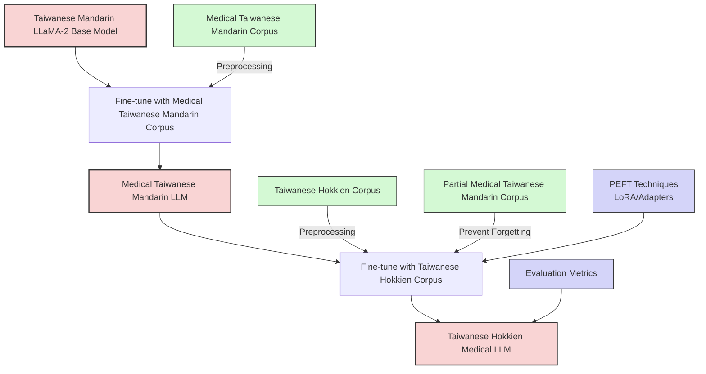
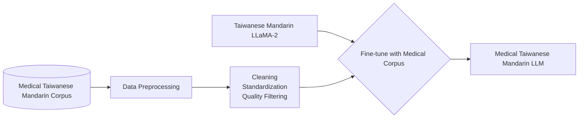
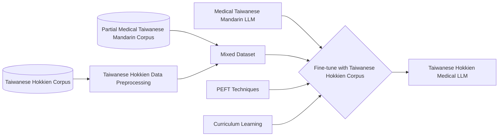
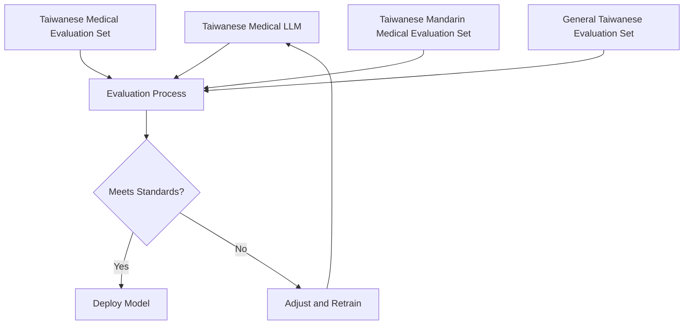

# Fine-Tuning a Taiwanese Hokkien LLM for Medical Advising

<!-- 
Discuss: Value proposition: Your will propose a machine learning system that can be 
used in an existing business or service. (You should not propose a system in which 
a new business or service would be developed around the machine learning system.) 
Describe the value proposition for the machine learning system. What’s the (non-ML) 
status quo used in the business (MUST include the company name) or service? What business metric are you going to be 
judged on? (Note that the “service” does not have to be for general users; you can 
propose a system for a science problem, for example.)
-->

Taiwanese Hokkien, commonly known as the Taiwanese language or Taiwan Taigi (臺灣台語), is a language spoken natively by approximately 70% of Taiwan's population.

Currently, elderly individuals in rural areas spend considerable time and energy reaching hospitals for consultations. Due to the digital divide, existing communication software-based video consultation services remain underutilized by the elderly population.

Our project aims to create a large language model specialized in medical advisors capable of communicating in Taiwanese Hokkien. This model could provide preliminary medical information to elderly speakers, enhancing disease prevention and encouraging early treatment. We can then integrate the LLM with existing Taiwanese Hokkien [Speech-to-Text](https://www.kaggle.com/competitions/espnet-taiwanese-asr/overview) and [Text-to-Speech](http://tts001.iptcloud.net:8804/)*1 models to provide a voice-based service. This human-centered design minimizes technology adoption barriers by meeting users in their native language context, extending technological assistance to traditionally underserved rural communities and elderly populations who might otherwise struggle with standard Mandarin UI-based systems.

The system will be explicitly designed and marketed as a preliminary information tool rather than a diagnostic service. Users will be informed that "this system provides general health information only and is not a substitute for professional medical diagnosis or treatment." We will also need a committee of healthcare professionals to review system responses periodically and make sure AI suggestions do not make mistakes. The system will need to comply with Taiwan FDA's Artificial Intelligence / Machine Learning - Based Software as Medical Device ([AI/ML-Based SaMD](https://www.fda.gov.tw/tc/includes/GetFile.ashx?id=f637648052118207932)) and Taiwan FDA's [Guidance for Industry on Management of Cybersecurity in Medical Devices](https://www.fda.gov.tw/tc/includes/GetFile.ashx?id=f637558103530220620)

We anticipate that hospitals and clinics could adopt or integrate this system into the existing National Health Insurance App, enabling technology to assist previously underserved rural and elderly populations. This would promote better health outcomes among citizens while improving resource utilization efficiency across Taiwan's healthcare system, creating a more accessible and equitable healthcare environment that respects linguistic preferences while leveraging technological innovation.

*1, this is a demo website of TTS system developed by Speech AI Research Center, National Yang Ming Chiao Tung University, Taiwan
### Contributors

<!-- Table of contributors and their roles. 
First row: define responsibilities that are shared by the team. 
Then, each row after that is: name of contributor, their role, and in the third column, 
you will link to their contributions. If your project involves multiple repos, you will 
link to their contributions in all repos here. -->

| Name             | Responsible for                             | Link to their commits in this repo |
|------------------|---------------------------------------------|------------------------------------|
| All team members |                                             |                                    |
| Team member 1    | Model training (unit 4 and 5)               | Ping-Jung(Lawrence)Lu              |
| Team member 2    | Model serving (unit 6), monitoring (unit 7) | Chun-Ju Tao                        |
| Team member 3    | Data pipeline (unit 8)                      | TsuYun Chen                        |
| Team member 4    | Continuous X pipeline (unit 3)              | Yi Syuan Chung                     |

### System diagram

<!-- Overall digram of system. Doesn't need polish, does need to show all the pieces. 
Must include: all the hardware, all the containers/software platforms, all the models, 
all the data. -->

#### Taiwanese Medical LLM Construction Process

#### Training Stage Details
Stage 1: Medical Taiwanese Mandarin LLM Construction

Stage 2: Taiwanese Hokkien Medical LLM Conversion

#### Evaluation and Deployment Process

### Summary of outside materials

<!-- In a table, a row for each dataset, foundation model. 
Name of data/model, conditions under which it was created (ideally with links/references), 
conditions under which it may be used. -->

| Name                                | Type       | How it was created                                                                       | Conditions of use                                                                                        |
|-------------------------------------|------------|------------------------------------------------------------------------------------------|----------------------------------------------------------------------------------------------------------|
| MedQA                               | Dataset    | Collecting QAs and textbooks from multiple regions and processing them into JSONL format | MIT                                                                                                      |
| Taiwanese Hokkien Corpus (Huē-ji̍p) | Dataset    | Compiling Taiwanese Hokkien Corpus from Dictionary, News, and more                       | MIT, CC BY-ND 3.0 TW                                                                                     |
| TIADE-LX                            | Base model | Fine-tuning LLaMA2-7B with Taiwanese domain-specific data                                | Free under a non-exclusive, non-transferable license, provided compliance with Meta AI’s Llama 2 license |
| Taiwanese Hokkien LLM               | Base model | Fine-tuning TIADE-LX on a limited Taiwanese Hokkien corpus                               | MIT                                                                                                      |

### Summary of infrastructure requirements

<!-- Itemize all your anticipated requirements: What (`m1.medium` VM, `gpu_mi100`), 
how much/when, justification. Include compute, floating IPs, persistent storage. 
The table below shows an example, it is not a recommendation. -->

| Requirement     | How many/when                                     | Justification |
|-----------------|---------------------------------------------------|---------------|
| `m1.medium` VMs | 3 for entire project duration                     | ...           |
| `gpu_mi100`     | 4 hour block twice a week                         |               |
| Floating IPs    | 1 for entire project duration, 1 for sporadic use |               |
| etc             |                                                   |               |

### Detailed design plan

<!-- In each section, you should describe (1) your strategy, (2) the relevant parts of the 
diagram, (3) justification for your strategy, (4) relate back to lecture material, 
(5) include specific numbers. -->

#### Model training and training platforms

<!-- Make sure to clarify how you will satisfy the Unit 4 and Unit 5 requirements, 
and which optional "difficulty" points you are attempting. -->

#### Model serving and monitoring platforms

<!-- Make sure to clarify how you will satisfy the Unit 6 and Unit 7 requirements, 
and which optional "difficulty" points you are attempting. -->

#### Data pipeline

<!-- Make sure to clarify how you will satisfy the Unit 8 requirements,  and which 
optional "difficulty" points you are attempting. -->
    Persistent Storage  
    - **Chameleon Cloud**  

    Offline Data  
    - **JSON**  

    Data Pipelines  

    - Data Sources  
    *(Refer to the outside meterials section above)*  

    1. Med QA (JSON file)  
        - Extract into a **Pandas DataFrame** for preprocessing (formatting, labeling).  
        - Convert into a **Hugging Face dataset** for model training.  

    2. Taiwanese Corpus  
    - Already formatted as a **Hugging Face dataset**, directly used for training.  

    Online Data  
    - **Input text (real-time query)** → Format (combine with previous dialogue if applicable) → Feed into the **LLM for inference**.  

    Additional Steps:  
    - Preprocess input (tokenization, standardization).  
    - Handle streaming queries via **WebSocket/API**.  
    - Log and store responses for further analysis.  

#### Continuous X

##### Infrastructure Setup
- Entire infrastructure in Git, using Terraform (declarative) to provision computing resources.
- Use automation tools Argo Workflows to set up the environment.
- Containerize all components and deploy using a microservices architecture.
##### Data Preprocessing, CI/CD and continuous training 
- Automatically fetch and preprocess new data (Taiwanese medical corpus and general Taiwanese corpus) with a pipeline.
- Fine-tune Taiwanese Mandarin LLaMA-2 with the Medical Corpus to form Medical Taiwanese Mandarin LLM. Further fine-tune this model using Taiwanese Corpus.
- Automated evaluation pipeline runs, if the model does not meet performance standards, the pipeline triggers adjustments and retraining.
##### Deployment Process (Staged Deployment & Cloud-Native)
- Staged deployment process: Staging, Canary Release, Production Rollout.
